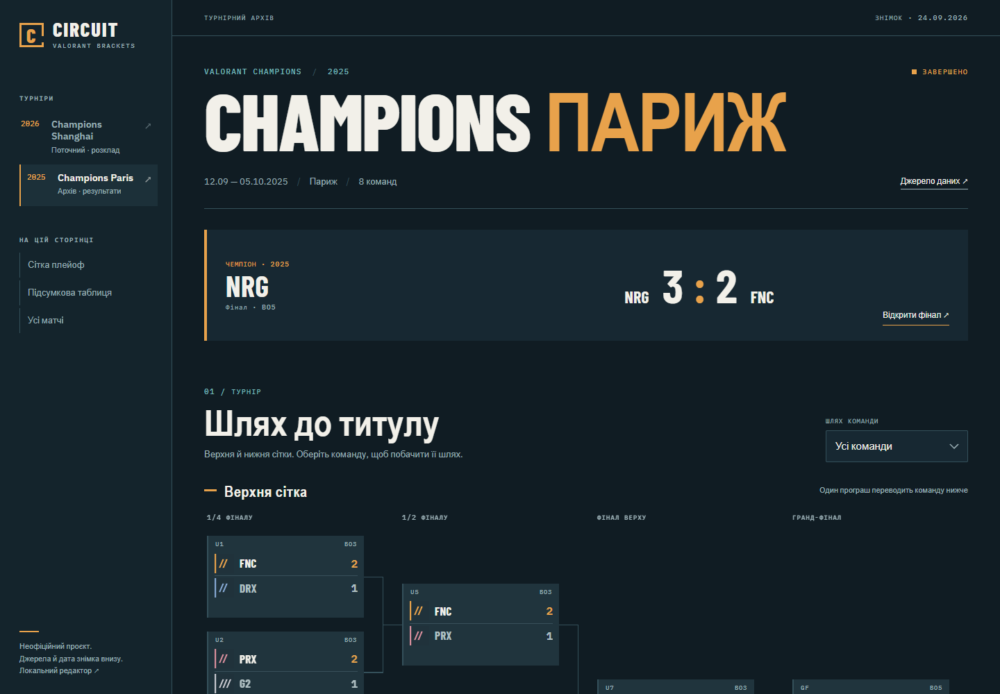

# Circuit

[Код на GitHub](https://github.com/Alemek1075/circuit-vct)



Неофіційний українськомовний сайт турнірних сіток VALORANT Champions. Завершений плейоф **Champions Paris 2025** має 14 перевірених матчів, верхню й нижню сітки та підсвічування маршруту команди. **Champions Shanghai 2026** показує 16 учасників і вісім оголошених стартових пар без вигаданих рахунків.

У списку матчів є фільтр за сіткою або днем. Сторінка команди показує графік різниці карт лише для зіграних матчів. Зміни рахунку, внесені локальним редактором, надходять у відкриті вкладки через SignalR без перезавантаження. Це не офіційний live feed.

Проєкт навчальний і не пов'язаний із Riot Games. Дані є знімком від 24.09.2026, а не автоматичною трансляцією. [Джерело результатів Paris](https://www.vlr.gg/event/2283/), [офіційний формат Shanghai](https://valorantesports.com/en-US/tournament/115576361459045501/overview) і [розклад](https://valorantesports.com/en-US).

## Запуск

Потрібен .NET SDK 8 або новіший. Із кореня репозиторію:

```powershell
dotnet restore src/Circuit/Circuit.csproj
dotnet run --project src/Circuit --urls http://127.0.0.1:5207
```

Відкрийте `http://127.0.0.1:5207`. EF Core автоматично застосовує migration і вводить початкові дані лише в порожню SQLite базу `src/Circuit/data/circuit.db`. Файл бази ігнорується Git. Публічні сторінки: `/`, `/team/{id}`, `/match/{id}`. Локальний редактор: `/studio`.

Редакторські MVC форми й API записи доступні тільки при `ASPNETCORE_ENVIRONMENT=Development`. У Production вони відповідають 404/403. Не відкривайте Development сервер у мережу без автентифікації.

## API

| Ресурс | Операції |
| --- | --- |
| `/api/tournaments` | GET список, POST; `/{id}` GET, PUT, DELETE |
| `/api/teams` | GET список із `tournamentId`, POST; `/{id}` GET, PUT, DELETE |
| `/api/teams/search?q=Pap&tournamentId=1` | GET підказок від трьох символів, максимум 12 |
| `/api/matches` | GET із `tournamentId`, `skip`, `limit`, абсолютним `nextLink`; POST; `/{id}` GET, PUT, DELETE |

`limit` від 1 до 100. Для матчу рахунки повинні бути або обидва порожні, або визначати переможця формату BO3/BO5. Видалення турніру чи команди з пов'язаними записами повертає 409. Записи в Production повертають 403.

## Перевірки

Потрібні Node.js 24 та Microsoft Edge на Windows; у GitHub Actions використовується Chromium.

```powershell
dotnet build src/Circuit/Circuit.csproj -c Release
npm ci
npm run test:e2e
```

Браузерні тести підіймають власний сервер і окрему тимчасову базу. Вони перевіряють сітки, відсутність вигаданих рахунків, маршрут команди, мобільну ширину, редактор, autocomplete та API. Для додаткової перевірки вже запущеного Development сервера:

```powershell
pwsh -NoProfile -File tests/ApiSmoke.ps1
```

Для повторення локального порівняння WebSockets, SSE і Long Polling запустіть `npm run bench:transport`. Скрипт сам запускає сервер з окремою базою й записує фактичні результати в [TRANSPORT_REPORT.md](TRANSPORT_REPORT.md).

Публічні HTML сторінки мають окремі описи, canonical адреси, `robots.txt` і динамічний `sitemap.xml`. Редактор позначено `noindex`.

## Контейнер

```powershell
docker compose up --build
```

Адреса `http://localhost:8080`, SQLite зберігається в `circuit_data`. Compose запускає Production, тож запис вимкнений. Опубліковану .NET збірку перевірено в Production: сторінка, health і CSS відповіли 200, редактор 404, API записи 403. `docker compose config --quiet` пройшов; реальний запуск контейнера на цій машині ще не підтверджено через недоступний Docker daemon.

## Документи

[Специфікація](SPEC.md), [дизайн](DESIGN.md), [етапи до п'яти годин](PROMPTS.md), [короткий переносний опис](PROJECT_BRIEF.md) і [фактичний прогрес](PROGRESS.md).
